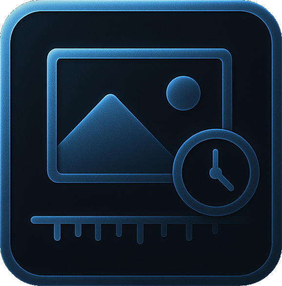

<p align="center">
  
</p>

<h1 align="center">ChronoView</h1>

# ChronoView

**ChronoView** is a minimalist photo timeline viewer built with **WinUI 3** and **C# (MVVM pattern)**.  
It lets you explore your images through time — smooth, responsive, and focused on clean UI and intuitive interaction.

---

## 🕓 Overview

ChronoView visualizes JPEG images from a selected folder along a horizontal timeline.  
Each photo is positioned based on its creation date, allowing you to scroll or zoom through your visual history.  
The main viewer dynamically updates to display the image corresponding to the center point of the timeline.

---

## ✨ Features

- 📁 **Folder-based photo loading** — automatically scans and loads `.jpg` / `.jpeg` files  
- 🖼️ **Timeline view** — displays each image according to its timestamp  
- 🔍 **Zoom & Pan** — intuitive timeline navigation  
- 🪄 **Smooth transitions** — optional animations for zoom and image changes  
- 💬 **Hover previews** — thumbnail tooltips (optional extra)  
- ⏯️ **Slideshow mode** — play through images as a continuous sequence  

---

## 🧩 Tech Stack

- **Language:** C#  
- **Framework:** WinUI 3  
- **Architecture:** MVVM (Model–View–ViewModel)  
- **UI/UX:** Responsive layout, touch & mouse support  
- **Async loading:** optional, for handling large image sets  

---

## 🧠 Concept

ChronoView is a personal exploration of **temporal storytelling through images**.  
It combines simple data binding and reactive UI concepts with a focus on **clean design and user flow**.  
It also serves as a small demonstration of **WinUI + MVVM structure** in a modern desktop context.

---

## 🚀 Getting Started

1. Clone this repository  
   ```bash
   git clone https://github.com/yourusername/ChronoView.git
