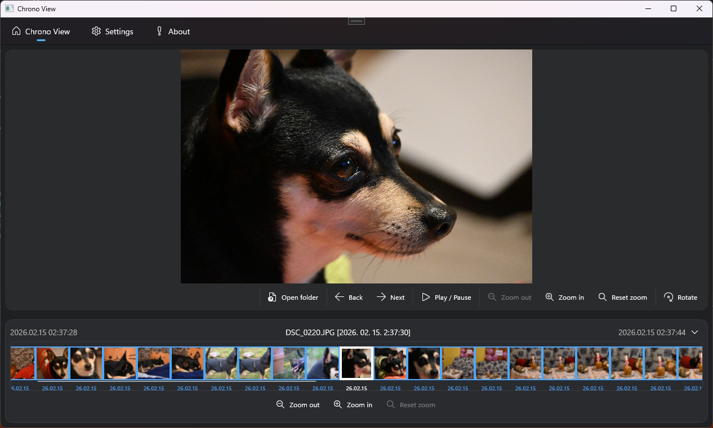
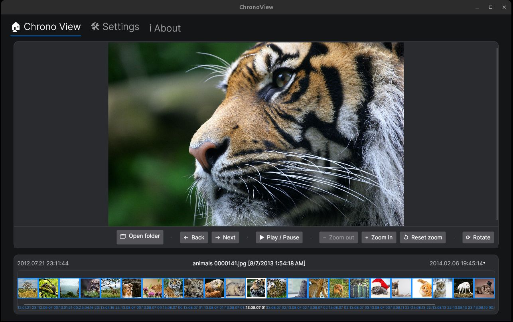

<p align="center">
  
</p>

<h1 align="center">ChronoView </br></br>

 
  


<a href="https://github.com/4dillusions/ChronoView/actions/workflows/dotnet.yml">
  
</a>

</h1>

ChronoView is a minimalist photo timeline viewer built with **WinUI 3**, **Avalonia** and **C# (MVVM pattern)**.  
It lets you explore your images through time — smooth, responsive, and focused on clean UI and intuitive interaction.

<p align="center">
  
  
</p>

---

## 🕓 Overview

ChronoView visualizes JPEG (and other formats) images from a selected folder along a horizontal timeline.  
Each photo is positioned based on its creation date, allowing you to scroll or zoom through your visual history.  
The main viewer dynamically updates to display the image corresponding to the center point of the timeline.

---

## ✨ Features

- 📁 **Folder-based photo loading** — automatically scans and loads `.jpg` and other image files  
- 🖼️ **Timeline view** — displays each image according to its timestamp  
- 🔍 **Zoom & Pan** — intuitive timeline navigation  
- 🪄 **Smooth transitions** — optional animations for zoom and image changes  
- 💬 **Hover previews** — thumbnail tooltips (optional extra)  
- ⏯️ **Slideshow mode** — play through images as a continuous sequence  

---

## 🧩 Tech Stack

- **Language:** C#  
- **Framework:** WinUI 3, Avalonia, .NET 10
- **Architecture:** MVVM (Model–View–ViewModel)  
- **UI/UX:** Responsive layout, touch & mouse support  
- **Async loading:** optional, for handling large image sets  

---

## 🧠 Concept

ChronoView is a personal exploration of **temporal storytelling through images**.  
It combines simple data binding and reactive UI concepts with a focus on **clean design and user flow**.  
It also serves as a small demonstration of **WinUI/Avalonia + cross-platform MVVM structure** in a modern desktop context.

---

## 📥 Clone
Clone the entire project including the submodules:<br>
```bash
git clone --recurse-submodules https://github.com/4dillusions/ChronoView.git
```

If the project is already cloned and you forgot to fetch the submodules:<br>
```bash
git submodule update --init --recursive
```

If the submodules have been updated and you want to fetch the latest changes:<br>
```bash
git submodule update --remote --merge
```

## 📦 Publish

To generate self-contained Avalonia builds for Windows and Linux, run the publish script:

```bash
bash scripts/publish-avalonia.sh
```

On Linux and macOS, run it directly from a terminal.

On Windows, run it from a Bash-compatible shell such as:
- Git Bash
- WSL
- MSYS2

Example on Windows (Git Bash / WSL):

```bash
bash scripts/publish-avalonia.sh
```

This creates publish outputs under:

```text
artifacts/publish/avalonia/win-x64
artifacts/publish/avalonia/linux-x64
```

You can also pass a build configuration explicitly:

```bash
bash scripts/publish-avalonia.sh Debug
```
